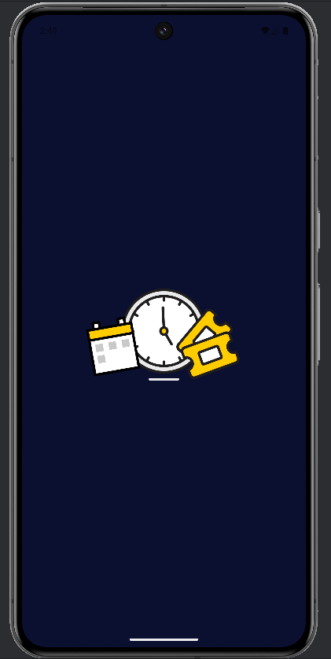
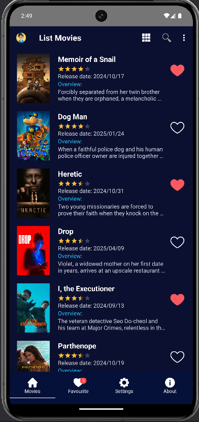
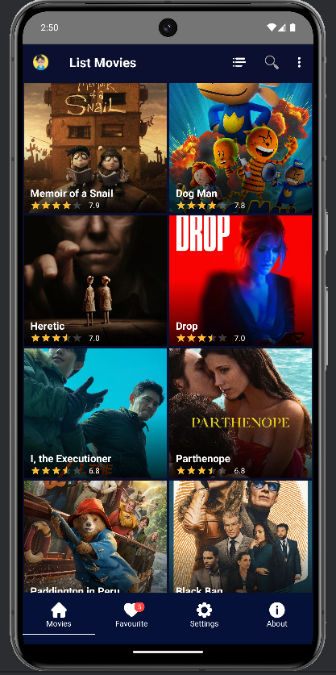
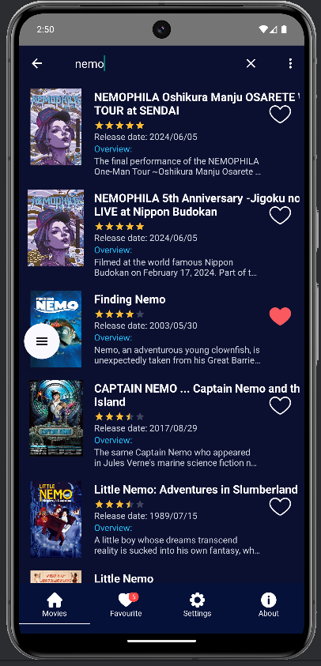
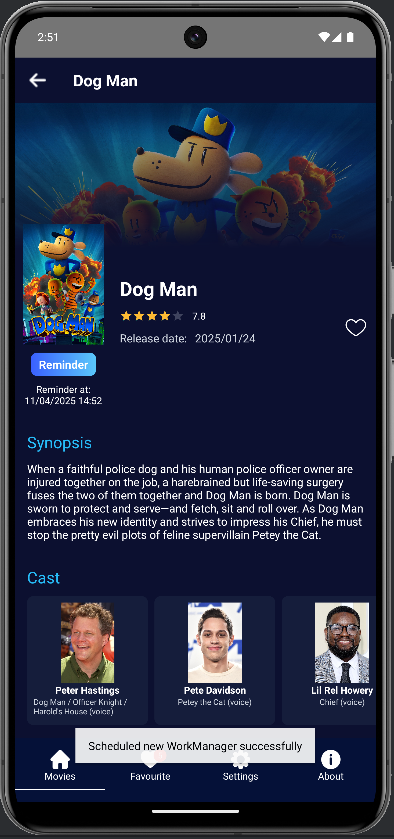
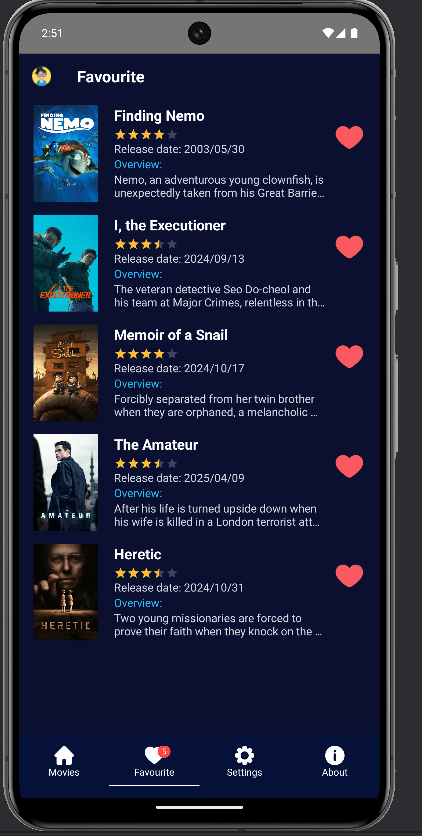
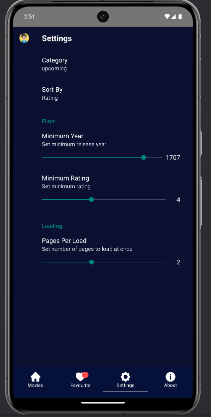
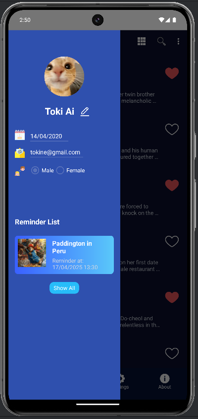
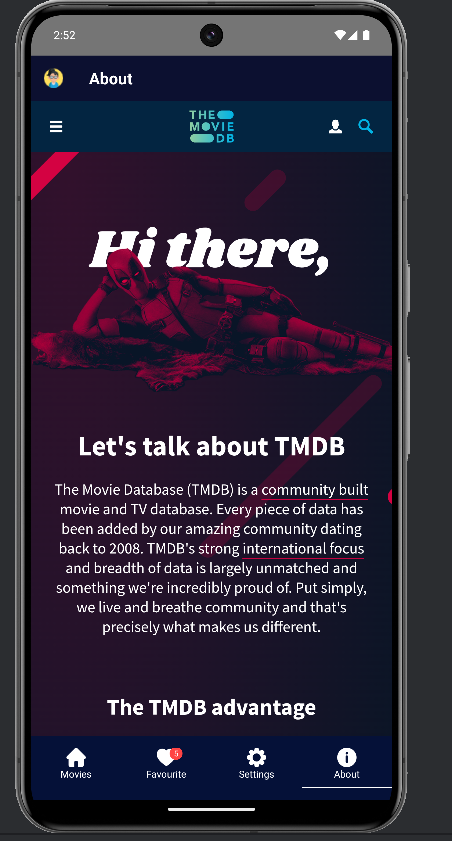
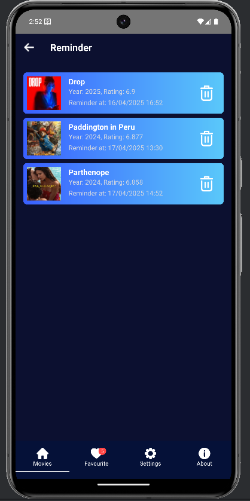

# Movie App

A modern Android application for browsing and managing movies using The Movie Database (TMDB) API.

## Features

- Browse popular, top-rated, upcoming, and now-playing movies
- Add/remove movies to/from favorites
- Advanced filtering and sorting options:
  - Filter by release year range
  - Filter by minimum rating
  - Sort by rating or release date
  - Customize number of pages to load per request
- Search functionality
- Grid and List view modes
- Profile drawer with user information
- User Profile Management:
  - Save and edit user profile information
  - Profile synchronization across devices
- Reminder and Notification System:
  - Set reminders for upcoming movies
  - Customizable notification schedules
  - Push notifications for movie releases
  - Local notifications for reminders

## Screenshots

### Splash Screen



### Movie List (List View)



### Movie List (Grid View)



### Search



### Movie Details



### Favorites



### Settings



### Profile Drawer



### About



### Reminder



## Technical Stack

- **Architecture**: Clean Architecture with MVVM pattern
- **Dependency Injection**: Dagger Hilt
- **Networking**: Retrofit for API calls
- **Database**:
  - Room for local storage
  - Firebase Realtime Database for user profiles
- **Paging**: Android Paging 3 for efficient data loading
- **Reactive Programming**: RxJava 3
- **Image Loading**: Picasso
- **UI**:
  - Material Design Components with custom themes
  - Data Binding for efficient UI updates
  - LiveData for reactive UI updates
- **Background Tasks**: WorkManager for reliable reminder scheduling

## Project Structure

```
app/
├── data/           # Data layer implementation
│   ├── source/
│   │   ├── local/  # Room database and DAOs
│   │   ├── remote/ # API service and models
│   │   └── firebase/ # Firebase services
│   └── repository/ # Repository implementations
├── domain/         # Domain layer
│   ├── entity/     # Business models
│   ├── repository/ # Repository interfaces
│   └── usecase/    # Use cases
└── presentation/   # UI layer
    ├── di/         # Dependency injection
    ├── ui/         # Activities, Fragments, ViewModels
    ├── adapter/    # RecyclerView adapters
    └── notification/ # Notification and reminder services
```

## Getting Started

1. Clone the repository
2. Get an API key from [The Movie Database](https://www.themoviedb.org/settings/api)
3. Add your API key to `local.properties`:
   ```
   TMDB_API_KEY=your_api_key_here
   ```
4. Set up Firebase:
   - Create a new Firebase project
   - Add your `google-services.json` to the app directory
   - Enable Firebase Authentication and Realtime Database
5. Build and run the app

## Dependencies

```gradle
// Core
implementation 'androidx.core:core-ktx:1.12.0'
implementation 'androidx.appcompat:appcompat:1.6.1'
implementation 'com.google.android.material:material:1.11.0'

// Architecture Components
implementation 'androidx.lifecycle:lifecycle-viewmodel-ktx:2.7.0'
implementation 'androidx.lifecycle:lifecycle-runtime-ktx:2.7.0'
implementation 'androidx.lifecycle:lifecycle-livedata-ktx:2.7.0'
implementation 'androidx.room:room-runtime:2.6.1'
implementation 'androidx.room:room-rxjava3:2.6.1'

// Data Binding
implementation 'androidx.databinding:databinding-runtime:8.2.0'

// Dependency Injection
implementation 'com.google.dagger:hilt-android:2.48'
kapt 'com.google.dagger:hilt-compiler:2.48'

// Networking
implementation 'com.squareup.retrofit2:retrofit:2.9.0'
implementation 'com.squareup.retrofit2:converter-gson:2.9.0'
implementation 'com.squareup.retrofit2:adapter-rxjava3:2.9.0'

// Reactive
implementation 'io.reactivex.rxjava3:rxjava:3.1.8'
implementation 'io.reactivex.rxjava3:rxandroid:3.0.2'

// Image Loading
implementation 'com.squareup.picasso:picasso:2.8'

// Firebase
implementation platform('com.google.firebase:firebase-bom:32.7.0')
implementation 'com.google.firebase:firebase-analytics'
implementation 'com.google.firebase:firebase-auth'
implementation 'com.google.firebase:firebase-database'
implementation 'com.google.firebase:firebase-messaging'

// WorkManager
implementation 'androidx.work:work-runtime-ktx:2.9.0'

// Testing
testImplementation 'junit:junit:4.13.2'
androidTestImplementation 'androidx.test.ext:junit:1.1.5'
androidTestImplementation 'androidx.test.espresso:espresso-core:3.5.1'
```

## Acknowledgments

- [The Movie Database API](https://www.themoviedb.org/documentation/api)
- [Android Architecture Components](https://developer.android.com/topic/libraries/architecture)
- [Firebase](https://firebase.google.com/)
